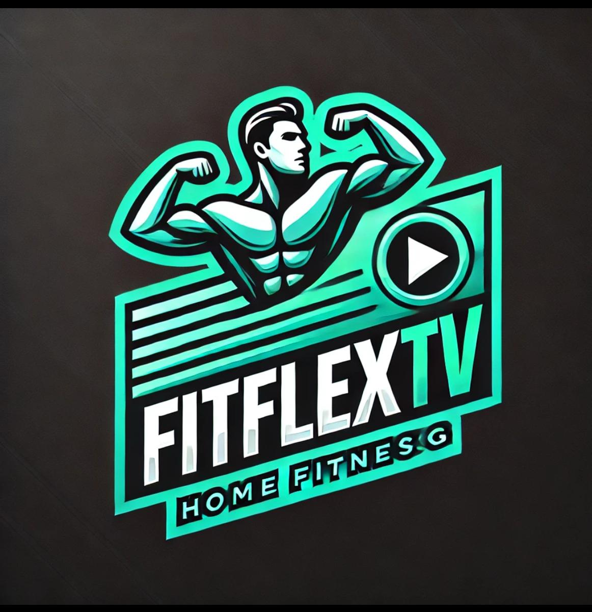
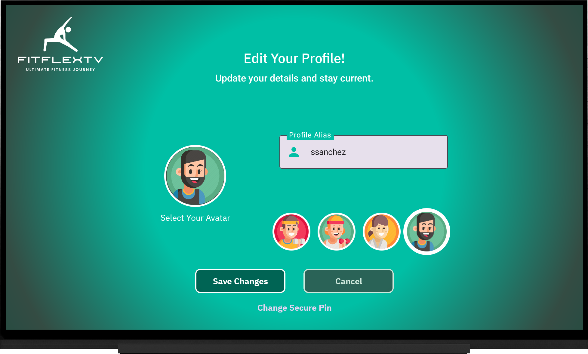
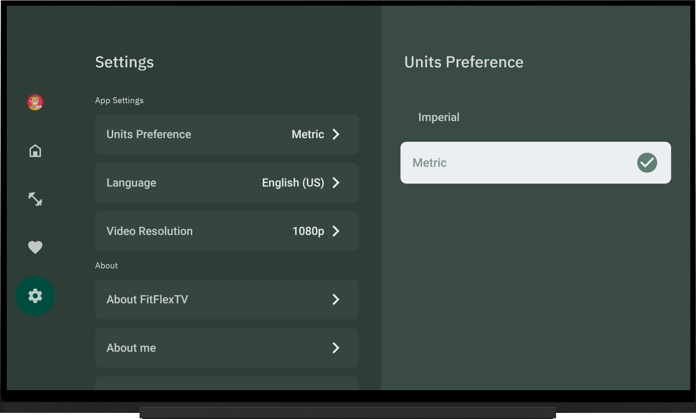

# FitFlexTV: A Personal Learning Journey in Fitness App Development 🏡💪



Welcome to **FitFlexTV** 🎉! This app was created as part of my learning journey to explore fitness app development, particularly on Smart TVs 📺.

**FitFlexTV** was built with **Jetpack Compose for TV**, along with the [**🍮 Fudge**](https://github.com/sergio11/fudge_tv_compose_library) UI Kit, a Jetpack Compose library for TV apps. This helped me understand how to create smooth, engaging experiences for larger screens 🎬.

The goal of this project wasn’t just to explore **fitness** 🏋️‍♀️ app development, but also to improve my understanding of **software architecture** 🏛️ and best practices. I focused on applying **dependency injection** 🔌, designing clean and scalable code, and diving deeper into concepts specifically related to **Android TV** 📱 development.

Through this project, I aimed to deepen my knowledge in **user experience** 🚀, fine-tuning **UI components** 🎨, and mastering **real-time data management** ⚡ for TV apps. My hope is that this project strengthens my skills and helps me grow as a developer, particularly in building more **robust** and **maintainable** Android TV applications.

A huge thank you to the creators of **[JetFit](https://github.com/TheChance101/tv-samples/tree/JetFit/JetFit)** and the contributors to **[PR #183](https://github.com/android/tv-samples/pull/183)** for providing an invaluable foundation for **FitFlexTV**. This is an attempt to provide an open-source implementation of JetFit. Licensed under **Apache 2.0** (implementation) and **CC BY 4.0** (design), JetFit served as a key reference for building a seamless **Jetpack Compose for TV** experience. I encourage you to visit the PR, review the effort, and give the deserved recognition. For more details and attributions, please check the **"Credits"** section below. 🚀

This app, **fitflextv**, includes images and resources designed by [Freepik](https://www.freepik.com). We would like to acknowledge and thank Freepik for their incredible design assets. The images used in the app are provided with attribution, as required by Freepik's licensing terms. For more information on Freepik's resources, please visit [www.freepik.com](https://www.freepik.com).

For demonstration purposes, the **Workout Player** uses a free stock video from Mixkit, showcasing a **shirtless young man lifting a heavy barbell**. This video is used solely to illustrate the player’s functionality
[Free Stock Video: A Shirtless Young Man Lifting a Barbell](https://mixkit.co/free-stock-video/a-shirtless-young-man-does-repetitions-lifting-the-heavy-barbell-52094/)

<p align="center">
  
  
  
  
  
</p>

<p align="center">


</p>

Slides are built using the  template from [Previewed](https://previewed.app/template/AFC0B4CB). I extend my gratitude to them for their remarkable work and contribution.

## ⚠️ Disclaimer  

This project, **FitFlexTV**, has been developed **for educational purposes only**. The main goal is to explore and learn how to build **modern Android TV applications** using **Jetpack Compose** and related technologies.  

**FitFlexTV does not provide any workout content, streaming services, or fitness programs.** Instead, it serves as a **demonstration project** showcasing how to design and develop TV-based fitness applications. The UI, navigation, and functionalities are implemented to simulate a real-world fitness app experience.  

Additionally, the name **"FitFlexTV"** was generated during a **brainstorming session with AI**, and any resemblance to existing brands or services is purely **coincidental**.  

The **logo of FitFlexTV** was **generated by ChatGPT** and is **free of copyright restrictions**. It is provided exclusively for **demonstration and educational purposes** and does not represent an actual brand or commercial entity.  

This repository is intended solely for **learning, experimentation, and non-commercial purposes**. If you wish to develop a real fitness app, please ensure compliance with content licensing, health guidelines, and data privacy regulations.  

## Overview 🌐

**FitFlexTV** was created as part of my personal project to learn more about app development, particularly for **fitness** 🏋️‍♀️ on **Smart TVs** 📺. The idea behind it was to explore how to build an app that offers a range of workouts suitable for different fitness levels and preferences 🌈. It includes both free and premium content 💎, so there’s something for everyone to try, and I wanted to experiment with adding features that would personalize the workout experience 🎵.

To make the app more engaging, I incorporated features like the ability to mark **favorite workouts** ❤️, apply filters 🔍, and create profiles 👨‍👩‍👧‍👦 for multiple users in a household. The goal was to learn how to create a more tailored experience for different users, even in a fitness app.

Additionally, I explored integrating recommendations 🤖 based on a user’s fitness profile, helping guide people to workouts that align with their goals. Whether it’s strength training 💪, flexibility 🤸‍♂️, or staying active 🚶‍♀️, **FitFlexTV** aims to provide tools to help users stick to their fitness journey.

### 💪 Tailored Workouts Just for You

The idea behind **FitFlexTV** was to offer workouts that are as unique as each person. It was a chance for me to experiment with creating plans that are personalized to a user’s goals, preferences, and fitness level. Whether it’s HIIT, strength training, yoga, or stretching, I wanted the app to provide varied options, with clear instructions and video demonstrations so anyone can jump in and start.

<p align="center">
  
</p>

This project also helped me dive into the concept of offering **free** workouts for everyone and **premium content** for users who want to level up their training. I wanted to explore how to handle both content types and how to keep things simple for the user.

### 📊 Track Your Progress, Celebrate Your Success

As part of my learning, I wanted to include progress tracking 📊 to keep users motivated. **FitFlexTV** allows you to monitor stats like calories burned, workout duration, and completed sessions. This gave me a chance to experiment with data tracking and visualize how users improve over time, whether it’s small wins or bigger milestones.

<p align="center">
  
</p>

### 🎧 Personalized Experience with Music and More

One feature I explored was adding personalized **music tracks** 🎧 to workouts, which can help keep users focused and motivated. I also wanted to give users the flexibility to choose their own music preferences. I enjoyed experimenting with these customization options to see how they could improve the workout experience.

### 🌟 Favorites and Recommendations

To make the app easier to use, I included a way for users to mark their favorite workouts ❤️ and easily access them later. I also added **smart recommendations** 🤖 based on their fitness profile, which was a great way for me to practice creating a system that offers personalized workout suggestions.

<p align="center">
  
</p>

**FitFlexTV** was a fun and educational project where I got to explore a variety of app development concepts, from **personalized user experiences** to **real-time data management**. It was an opportunity to dive into building a **fitness app for Smart TVs** while improving my skills in user engagement and data handling.


### 👨‍👩‍👧‍👦 Multiple Profiles for the Whole Family

One feature I explored in **FitFlexTV** was the ability to manage multiple profiles. This allows different users (like family members) to have their own personalized workout plans and track their progress individually. It was an opportunity to experiment with managing user data and creating personalized experiences for each user, learning how to scale the app to accommodate various profiles.

### 🕒 Work Out on Your Schedule, Anywhere, Anytime

The goal of this feature was to design an experience that adapts to different schedules. Whether you have just a few minutes or a full hour, **FitFlexTV** is flexible enough to fit your time constraints. I focused on how to create an accessible workout experience that doesn’t require extra setup, giving users the freedom to work out whenever and wherever they want.

### 💬 Stay Motivated and Inspired

Motivation can be a challenge, so I added features like reminders, tips, and inspirational quotes to help keep users engaged. This was a chance for me to explore how small motivational elements can enhance the user experience. I also looked into ways to build a sense of community within the app, where users could share progress or receive encouragement, keeping them motivated throughout their fitness journey.

<p align="center">
  
</p>

### 🌟 Start Your Fitness Journey Today

**FitFlexTV** is a personal project I created to experiment with Android TV development using Jetpack Compose. Through this project, I’ve been able to dive deeper into app architecture, UI design, and working with large-screen experiences. While the app isn’t a final product, it has provided me with valuable learning experiences and an opportunity to apply new skills in a real-world context.

<p align="center">
  
</p>


## Technologies Used 🛠️

- **Kotlin**: The language of choice for developing Android applications, offering modern syntax and powerful features to streamline coding and enhance productivity. 🚀

- **Firebase Platform**:
  - **Firestore**: 🔥 A NoSQL cloud database that provides real-time data synchronization and offline support. It scales seamlessly with your app's needs, ensuring fast and reliable data retrieval. 📊✨
  - **Firebase Auth**: 🔐 Handles user authentication with ease, providing secure sign-in and user management capabilities. Supports various authentication methods, including email/password, social media logins, and more. 🛡️📱
  - **Firebase Storage**: ☁️ Stores and serves user-generated content like profile images and media files. Offers robust and scalable storage solutions with built-in security and easy integration with other Firebase services. 📸🎥

- **Coroutines**: 🌀 Simplifies asynchronous programming and manages background tasks efficiently. Ensures smooth, non-blocking operations, enhancing the app's responsiveness and user experience. ⏱️

- **Clean Architecture**: 🏗️ Promotes a well-structured and scalable app design by separating concerns into distinct layers. Enhances maintainability, testability, and overall robustness of the application. 🔍

- **MVI (Model-View-Intent)**: 📈 Implements a unidirectional data flow pattern, making state management predictable and consistent. Ensures a clear separation between UI components and business logic. 🔄

- **Jetpack Compose for TV**: 📺 Leverages Jetpack Compose to build modern, responsive UIs tailored for TV screens. Focuses on reusability and a seamless viewing experience, optimizing the interface for large displays. 🎨

- **Jetpack Compose Navigation**: 🗺️ Facilitates in-app navigation and screen transitions with a clear and concise API. Supports deep linking and helps manage complex navigation flows effortlessly. 🚦

- **Material Design 3**: 🎨 Applies the latest Material Design guidelines to create a visually appealing and intuitive user interface. Ensures consistency and enhances the overall aesthetic of the app. 🖌️

- **🍮 Fudge**: [Fudge](https://github.com/sergio11/fudge_tv_compose_library) is a Jetpack Compose UI Kit tailored for TV apps. It provides pre-built components and tools to craft engaging and seamless experiences on the big screen. Simplify your TV app development with Fudge! 🎬🚀

- **Jetpack DataStore**: 💾 A modern data storage solution for storing key-value pairs and typed objects. Provides a robust and asynchronous API for data management, ensuring consistent and reliable data handling in your app. 🔐

- **Media3 for Media Playback**:
  - **Media3 ExoPlayer**: 🎥 Part of the Media3 library, ExoPlayer is a powerful media player that supports a wide range of media formats and advanced features like adaptive streaming and DRM support. Ensures high-quality and smooth playback experiences. 📻🍿
  - **Media3 UI**: 🎨 Provides UI components and tools to integrate media playback controls seamlessly into your app's interface. Enhances the media playback experience with customizable and user-friendly controls. 🕹️

- **Dagger Hilt**: 🧩 A dependency injection library that simplifies the management of dependencies in your app. It reduces boilerplate code and enhances modularity by providing a clear and concise way to inject dependencies and manage their lifecycle. 🔧💡

- **Mapper Pattern**: 🔄 Facilitates conversion between different data models (DTOs, BOs, etc.), ensuring data consistency and smooth interactions across various application components. 📐

## Architecture Overview 🏛️

Our application is designed with a robust and scalable architecture to ensure maintainability, testability, and flexibility. The architecture leverages several design patterns and principles to create a well-structured and efficient system.

### **Clean Architecture** 🏗️
Clean Architecture is the foundation of our design, focusing on separating concerns into distinct layers. This approach enhances the maintainability and testability of the code by isolating business logic from the UI and data layers. Our architecture typically includes the following layers:
- **Presentation Layer**: Handles the UI and user interactions, using Jetpack Compose for building modern and responsive interfaces.
- **Domain Layer**: Contains the business logic and use cases. It defines the core functionality of the application and is independent of external frameworks.
- **Data Layer**: Manages data sources and repositories, providing a consistent interface for data access. It abstracts the details of data retrieval and storage from the rest of the application.

### **Data Sources** 📦
Data sources are responsible for fetching and managing data from various origins. We utilize multiple data sources, such as:
- **Remote Data Sources**: Interact with cloud services or web APIs (e.g., Firebase Firestore, Firebase Auth).
- **Local Data Sources**: Handle local data storage (e.g., Jetpack DataStore, SQLite).

### **Repository Pattern** 🗃️
The repository pattern provides a unified interface for accessing data, regardless of whether it's coming from a remote server or local storage. Repositories manage data operations and serve as a single source of truth for the application's data. This pattern decouples data retrieval and storage from the rest of the application, allowing for easier testing and maintenance.

### **Use Cases** 🧩
In the Domain Layer, **Use Cases** (also known as Interactors) represent specific actions or operations that the application can perform. They encapsulate business logic and interact with repositories to retrieve or modify data. Use Cases ensure that the business rules and application flow are managed correctly, providing a layer of abstraction that protects the domain logic from changes in the data or presentation layers. By focusing on specific tasks or operations, Use Cases contribute to the modularity and flexibility of the application.

### **Inversion of Control (IoC)** 🔄
Inversion of Control is a principle where the control flow of the application is inverted. Dependencies are injected rather than being hardcoded. This is achieved through:
- **Dependency Injection (DI)**: Managed by Dagger Hilt, DI simplifies the management of dependencies and their lifecycle, promoting modularity and reducing boilerplate code.

### **SOLID Principles** 📏
We apply SOLID principles to ensure our codebase remains clean, modular, and maintainable:
- **Single Responsibility Principle (SRP)**: Each class or module has one responsibility, reducing complexity and improving cohesion.
- **Open/Closed Principle (OCP)**: Classes and modules are open for extension but closed for modification, promoting flexibility and reducing the risk of introducing bugs.
- **Liskov Substitution Principle (LSP)**: Subtypes must be substitutable for their base types without altering the correctness of the program, ensuring proper inheritance hierarchies.
- **Interface Segregation Principle (ISP)**: Clients should not be forced to depend on interfaces they do not use, promoting more focused and cohesive interfaces.
- **Dependency Inversion Principle (DIP)**: High-level modules should not depend on low-level modules; both should depend on abstractions. This principle encourages a more flexible and decoupled design.

### **MVI (Model-View-Intent)** 📈
MVI is employed for managing the state and interactions within the application:
- **Model**: Represents the application's state and business logic.
- **View**: Displays the UI and reacts to state changes.
- **Intent**: Represents user actions or events that drive changes in the state.

By applying MVI, we achieve a unidirectional data flow, making state management predictable and consistent.

This architecture ensures that our application is well-structured, easy to maintain, and scalable, while adhering to best practices and design principles.

## App Screenshots

Here are some screenshots from **FitFlexTV**, showcasing the different features I explored during the development process. This app is a personal project aimed at learning more about Android TV development with Jetpack Compose.

### Onboarding

The Onboarding screens are the first thing users see when they open the app. If there’s no active session, users are directed to the landing page, where they can view an introduction to the app and choose to log in or create a new account.

<p align="center">
  
</p>

<p align="center">
  
</p>

### Sign In

This screen allows users to log into the app using their email and password. If they don't have an account, they can quickly navigate to the registration page.

<p align="center">
  
</p>

<p align="center">
  
</p>

### Sign Up ✨

The signup process is straightforward—users can create an account by entering their details. This feature was useful for experimenting with authentication and form management.

<p align="center">
  
</p>

### Managing Your Profiles 🎭

The Profiles section allows users to customize their experience. In this part of the app, I implemented the ability to manage multiple profiles. Each user can set up their own preferences, including workout history, avatars, and personal settings.

<p align="center">
  
</p>

<p align="center">
  
</p>

Users can create up to four profiles, each with a unique alias and avatar, perfect for family members or multiple users. This feature gave me the chance to explore user data management and personalization in an app.

<p align="center">
  
</p>

<p align="center">
  
</p>

<p align="center">
  
</p>

It’s easy to edit your profile too—users can update their alias, avatar, or security PIN. This feature helped me learn more about handling user data securely and providing a personalized experience.

<p align="center">
  
</p>

<p align="center">
  
</p>

<p align="center">
  
</p>

<p align="center">
  
</p>

If a user no longer needs a profile, they can easily delete it. Deleting a profile also removes associated data, which was a good way to explore how to manage user data cleanup.

<p align="center">
  
</p>

<p align="center">
  
</p>

<p align="center">
  
</p>

<p align="center">
  
</p>

The **Profiles** section gave me the opportunity to dive deeper into the user experience, experimenting with data management and customizing the app for different users.

<p align="center">
  
</p>

<p align="center">
  
</p>


### Exploring the Home Screen 📱

Welcome to the Home Screen of **FitFlexTV**—a core part of my personal project where I explored designing a user-friendly interface for a fitness app on Android TV. The Home Screen provides users with an intuitive and engaging experience to kickstart their fitness journey.

At the top, you'll see the **Highlighted Trainings Carousel** 🎠. This feature showcases a rotating selection of standout workouts. It was a fun way to experiment with dynamic UI elements and learn how to create a visually appealing carousel to keep the user engaged.

<p align="center">
  
</p>

<p align="center">
  
</p>

<p align="center">
  
</p>

As you scroll down, you'll find the **Categories Row** 📊. This section organizes workouts into various categories like Cardio, Strength, and Yoga. I implemented this feature to learn about horizontal scrolling and filtering items efficiently.

<p align="center">
  
</p>

<p align="center">
  
</p>

The screen finishes with the **Recommended Trainings for Your Profile** ⭐. Based on user preferences and workout history, this section suggests the most relevant workouts. It was an opportunity to experiment with basic recommendation logic and display dynamic content tailored to the user.

<p align="center">
  
</p>

Overall, the Home Screen is designed to be intuitive and visually engaging, with a focus on learning UI/UX design for large screens and providing users with an easy way to explore workouts.

## Exploring Workouts and More 🏋️‍♀️✨

The **Workouts** section is where the real fun begins! In this part of the app, users can discover a variety of exercises based on their fitness goals. This feature was a big part of my learning process, helping me build dynamic workout categories and improve navigation on Android TV.

Here’s a breakdown of the workout categories:

- **Workouts** 💪: A wide range of exercises for different fitness levels and goals. Whether you're into cardio or strength training, I designed this section to be easy to navigate with a clear focus on filtering content based on type.

<p align="center">
  
</p>

<p align="center">
  
</p>

- **Series** 📈: Structured workout series that progressively guide users through different routines. Implementing this feature was a great exercise in designing consistent experiences that build on each other over time.

<p align="center">
  
</p>

- **Challenges** 🏆: Fun and motivational challenges that push users to reach new fitness milestones. I implemented this to learn how to gamify the fitness journey and keep users motivated.

<p align="center">
  
</p>

- **Routines** 🗓️: Comprehensive workout routines that combine various exercises. This section helped me learn how to group and organize content to ensure users can follow a structured path towards achieving their goals.

<p align="center">
  
</p>

Navigating these categories is easy thanks to the **filtering and sorting options** 🔍. This feature allowed me to dive into the details of how users can quickly find workouts based on their preferences and goals.

<p align="center">
  
</p>

<p align="center">
  
</p>

<p align="center">
  
</p>

<p align="center">
  
</p>

<p align="center">
  
</p>

Once a user selects a workout, they are taken to the **detailed view** 📋, where they can see all relevant information like instructions, duration, and tips. This section helped me understand how to present detailed content on a larger screen, ensuring users can make informed decisions.

The **Workouts** section was a key part of my learning experience, helping me understand how to display diverse content in an intuitive way while allowing for personalization and easy navigation. It’s all about making the user experience as seamless as possible.

🌟🚀


### Training Program Detail 🏋️‍♂️💪

The **Training Program Detail** screen is one of the key components of my **FitFlexTV** personal project. It provides the user with all the essential information to get the most out of every training session. While this is a conceptual feature, it was a great opportunity to dive into the design and functionality of a fitness app interface for Android TV.

- **Duration** ⏱️: Clearly displayed to help users plan their workout sessions efficiently, making sure they know exactly how much time they need.

- **Intensity** 🔥: Each workout is labeled with its intensity level, from gentle to challenging, allowing users to select exercises based on their energy levels and goals.

- **Workout Description** 📄: A detailed description of the workout, including the exercises, benefits, and what to expect, offering clarity to users before they start their session.

- **Instructor** 👩‍🏫: Each workout has an instructor profile with a background overview. Users can learn more about the instructor’s expertise and find other workouts led by them.

- **Start Workout** ▶️: A simple “Start” button to begin the session.

- **Play Music** 🎵: Access to workout music to enhance the session. This feature was implemented to add a customizable element, letting users play the music they enjoy during their workouts.

- **Add to Favorites** ⭐: Users can save their favorite workouts for easy future access.

- **More About the Instructor** 📚: For those who love an instructor’s style, they can explore more about their philosophy and background, which helps foster a stronger connection to the content.

This screen acts as the main control hub for users to dive deep into each workout, with the goal of inspiring and motivating them during their journey. It’s part of my experimentation with organizing workout data and creating a seamless, engaging interface. 💥🔥

<p align="center">
  
</p>

<p align="center">
  
</p>

<p align="center">
  
</p>

<p align="center">
  
</p>

<p align="center">
  
</p>

<p align="center">
  
</p>

<p align="center">
  
</p>

<p align="center">
  
</p>

<p align="center">
  
</p>

### Favorites Section 🌟

The **Favorites** section is designed to allow users to easily access their preferred workouts, offering a more personalized and efficient fitness journey. This part of the app was a great learning experience in terms of building a user-friendly and organized way to manage content.

#### What’s in the Favorites Section?

- **Quick Access:** All of the workouts you've marked as favorites are displayed for easy access.

- **Detailed View:** Tapping on a workout brings users to its detailed view, where they can review all the relevant information.

- **Easy Start:** Once you’ve found your favorite, starting the workout is just a click away.

This section helps users quickly get back to the workouts they enjoy the most, providing a simple but effective way to improve their experience.

<p align="center">
  
</p>

<p align="center">
  
</p>

<p align="center">
  
</p>

### Workout Player 🎥🎶

The **Workout Player** is where your workout comes to life. In my project, I focused on creating a smooth and immersive experience with high-quality video, intuitive controls, and synchronized music to keep the user motivated.

- **High-Quality Video** 📺: Full HD and 4K support, ensuring the best possible visual quality based on your connection.

- **Workout Controls** ⏯️: The player lets users pause, rewind, or skip forward, giving them control over their workout experience.

- **On-Screen Guidance** 🧭: Users can follow along with clear, real-time instructions from the instructor, helping them stay on track.

- **Music Integration** 🎧: Music is synced to the workout, enhancing the experience, whether users prefer high-energy beats or relaxing tunes.

- **Music Player** 🎵: If users just want to listen to the music, they can enjoy the workout playlist independently from the session.

- **Progress Tracking** 📊: Real-time progress tracking keeps users motivated by showing how much they’ve completed and how much is left.

- **Full-Screen Mode** 🖥️: Users can go full-screen for a distraction-free workout experience.

The **Workout Player** was a core feature that I worked on to ensure users have an engaging, smooth, and personalized experience while working out.

<p align="center">
  
</p>

<p align="center">
  
</p>

<p align="center">
  
</p>

<p align="center">
  
</p>

<p align="center">
  
</p>

<p align="center">
  
</p>

<p align="center">
  
</p>

### Subscription Options 🌟📅

The **Subscription Options** section is designed to offer flexibility for users, providing them with access to premium workouts and features. This section was an essential learning opportunity for implementing subscription management and adding value for the user.

Here’s how the subscription plans work:

- **Choose Your Plan** 🗓️: Users can select from 3-month, 6-month, or 12-month plans, each tailored to fit different fitness goals and levels.

- **Enjoy Discounts** 💰: Longer subscription periods come with discounts, making it a win-win for both the user and the app.

- **Unlock Premium Content** 🔓: Subscribers get access to exclusive, high-quality workouts and specialized training programs.

This section ensures users have access to premium features, making their fitness journey even more rewarding.

<p align="center">
  
</p>

<p align="center">
  
</p>

<p align="center">
  
</p>


### Settings 🛠️🔧

The **Settings** section in this **FitFlexTV** prototype acts as the personal control panel where users can adjust various settings to customize their experience. 🌟 This is just a demonstration of how this feature could be implemented in a fully functional app. Here’s an overview of the options that might be included:

- **Adjust Language** 🌐: Users could select their preferred language to make the app feel more intuitive. In this demo, the app could potentially support languages like English, Spanish, and more, allowing users to navigate easily in their language of choice.

- **Select Measurement Units** 📏: In this prototype, users can choose between metric or imperial units. This setting would allow the app to display workout metrics in kilometers, kilograms, miles, or pounds, based on the user’s regional preferences.

- **Set Video Quality** 📹: Users could select their preferred video quality for streaming. In a full app, options might include Full HD or an "Automatic" setting that adjusts video quality based on the user’s internet connection.

- **Learn About Us** 🧑‍💻: A section where users could learn more about the developers behind the app and the vision driving the project. This would help users connect with the team behind the app and understand its purpose.

- **Log Out** 🚪: This option would allow users to log out of their account or switch profiles. While basic, this feature is essential for managing multiple user accounts or taking a break from the app.

- **Manage Subscriptions** 💳: In this section, users could review and manage their subscription plans. While the demo doesn’t include actual payment functionality, in a real app, this would enable users to change or cancel their plans and manage access to premium content.

The **Settings** section in this test project demonstrates how users could personalize their experience. While these options aren’t functional in this demo, they give a clear idea of how they would work in a fully implemented version of the app. 🌟🛠️

<p align="center">
  
</p>

<p align="center">
  
</p>

<p align="center">
  
</p>

<p align="center">
  
</p>

<p align="center">
  
</p>

<p align="center">
  
</p>

## ⚠️ Disclaimer  

This project, **FitFlexTV**, has been developed **for educational purposes only**. The main goal is to explore and learn how to build **modern Android TV applications** using **Jetpack Compose** and related technologies.  

**FitFlexTV does not provide any workout content, streaming services, or fitness programs.** Instead, it serves as a **demonstration project** showcasing how to design and develop TV-based fitness applications. The UI, navigation, and functionalities are implemented to simulate a real-world fitness app experience.  

Additionally, the name **"FitFlexTV"** was generated during a **brainstorming session with AI**, and any resemblance to existing brands or services is purely **coincidental**.  

The **logo of FitFlexTV** was **generated by ChatGPT** and is **free of copyright restrictions**. It is provided exclusively for **demonstration and educational purposes** and does not represent an actual brand or commercial entity.  

This repository is intended solely for **learning, experimentation, and non-commercial purposes**. If you wish to develop a real fitness app, please ensure compliance with content licensing, health guidelines, and data privacy regulations.

## Contribution
Contributions to FitFlexTV Android are highly encouraged! If you're interested in adding new features, resolving bugs, or enhancing the project's functionality, please feel free to submit pull requests.


## 🎖️ Recognition & Credits  

FitFlexTV is developed and maintained by Sergio Sánchez Sánchez (Dream Software). Special thanks to the open-source community and the contributors who have made this project possible. If you have any questions, feedback, or suggestions, feel free to reach out at dreamsoftware92@gmail.com.

A huge thank you to the creators of **[JetFit](https://github.com/TheChance101/tv-samples/tree/JetFit/JetFit)** and the contributors to **[PR #183](https://github.com/android/tv-samples/pull/183)** for providing an invaluable foundation for **FitFlexTV**. This is an attempt to provide an open-source implementation of JetFit. Licensed under **Apache 2.0** (implementation) and **CC BY 4.0** (design), JetFit served as a key reference for building a seamless **Jetpack Compose for TV** experience. I encourage you to visit the PR, review the effort, and give the deserved recognition.

The **JetFit** project, licensed under **Apache 2.0**, has served as a foundational reference for implementing the **Jetpack Compose for TV UI framework**, while its design, licensed under **CC BY 4.0**, provided an excellent structure to build upon.  

### 📌 Resources:  
- **JetFit GitHub Repository**: [JetFit on GitHub](https://github.com/TheChance101/tv-samples/tree/JetFit/JetFit)  
- **JetFit Figma Design**: [JetFit Fitness App on Figma](https://www.figma.com/community/file/1237433831695839696/jetfit-fitness-app)  
- **JetFit Case Study & Guidelines**: [Google TV JetFit Case Study](https://developer.android.com/design/ui/tv/samples/jet-fit?hl=es-419)  
- **Google TV Design Kit**: [TV Design Kit (Figma)](https://developer.android.com/design/ui/tv/guidelines)  

The resources, examples, and insights provided in the **JetFit repository** significantly accelerated our development process and enriched our understanding of **building seamless TV applications using Jetpack Compose**. We deeply appreciate the contributions of the JetFit team and their dedication to open-source development.  

This project acknowledges and respects the **original JetFit implementation**, ensuring proper attribution under **Apache 2.0** and **CC BY 4.0** licenses. 🚀  

This project acknowledges and respects the work of the original **JetFit** creators and follows the **CC BY 4.0** license terms. If you are interested in designing a TV-based fitness app, we highly recommend exploring the **JetFit project and Google's TV design resources**.  

We express our deep appreciation to [Freepik](https://www.freepik.es/) for generously providing the resources used in this project.
<div> Icons and images takes from <a href="https://www.freepik.com" title="Freepik"> Freepik </a> from <a href="https://www.flaticon.es/" title="Flaticon">www.flaticon.es'</a></div>


For demonstration purposes, the **Workout Player** uses a free stock video from Mixkit, showcasing a **shirtless young man lifting a heavy barbell**. This video is used solely to illustrate the player’s functionality

[Free Stock Video: A Shirtless Young Man Lifting a Barbell](https://mixkit.co/free-stock-video/a-shirtless-young-man-does-repetitions-lifting-the-heavy-barbell-52094/)


## Visitors Count


 
 ## Please Share & Star the repository to keep me motivated.
  <a href = "https://github.com/sergio11/fitflextv_android/stargazers">
     
  </a>

## License ⚖️

This project is licensed under the **Apache License 2.0**, a permissive open-source software license that allows developers to freely use, modify, and distribute the software. 🚀 This includes both personal and commercial use, with some conditions for distribution and modification. 📜

Key terms of the Apache License 2.0:

- You are allowed to use, copy, modify, merge, publish, distribute, sublicense, and/or sell copies of the software. 💻
- If you modify and distribute the software, you must include the original copyright notice, provide a copy of the Apache 2.0 license, and indicate any modifications made. 📝
- You are not allowed to use the name of the project or its contributors to promote derived works without permission. ✋
- The software is provided "as is," without any warranties, express or implied. 🚫🛡️

Please see the full license text below for more detailed terms.

```
Apache License Version 2.0, January 2004 http://www.apache.org/licenses/

Copyright (c) 2024 Dream software - Sergio Sánchez

Licensed under the Apache License, Version 2.0 (the "License"); you may not use this file except in compliance with the License. You may obtain a copy of the License at

http://www.apache.org/licenses/LICENSE-2.0

Unless required by applicable law or agreed to in writing, software distributed under the License is distributed on an "AS IS" BASIS, WITHOUT WARRANTIES OR CONDITIONS OF ANY KIND, either express or implied. See the License for the specific language governing permissions and limitations under the License.
```
