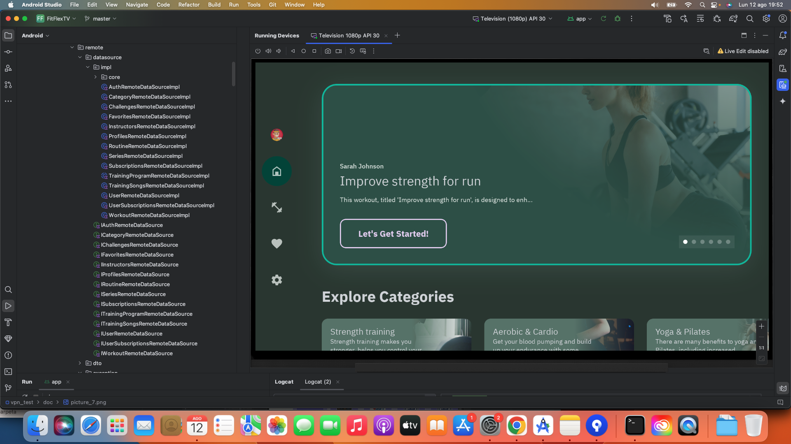
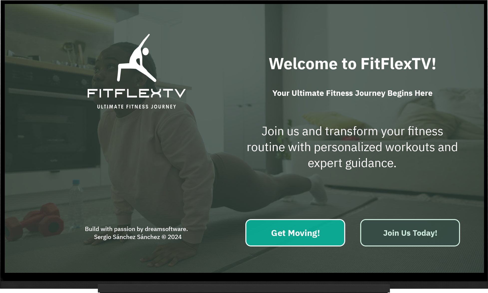
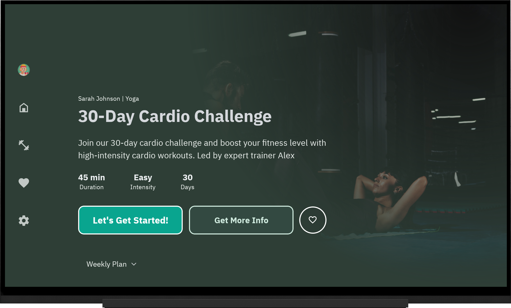

# Welcome to FitFlexTV: Your Ultimate Fitness Journey Begins Here! 🏡💪

Welcome to **FitFlexTV** 🎉, your go-to fitness companion designed to make working out from home as easy and enjoyable as possible. In today’s busy world 🕒, fitting in a workout can be a challenge. That’s why **FitFlexTV** brings the fitness studio to your Smart TV 📺, so you can exercise right from your living room without any hassle.

**FitFlexTV** is here to support you every step of the way on your fitness journey 🚀. Whether you’re just beginning your fitness adventure or looking to take your routine to the next level 🔝, our app is tailored to meet your individual needs. With a diverse selection of workouts 🏋️‍♀️, from high-energy HIIT sessions ⚡ to calming yoga routines 🧘‍♀️, you can find the perfect workout to match your mood and fitness goals.

Ready to start your fitness journey? **FitFlexTV** makes it easy to stay committed to your health and wellness goals 🎯. Begin working out from the comfort of your home and discover a world of fitness possibilities with **FitFlexTV** today. Let’s get started on the path to a healthier, happier you! 🚀✨

  
  
  
  
  

Slides are built using the  template from [Previewed](https://previewed.app/template/AFC0B4CB). I extend my gratitude to them for their remarkable work and contribution.

## Overview 🌐

With **FitFlexTV**, you can access a range of workouts designed for various fitness levels and preferences 🌈. Our app offers both free and premium content 💎, ensuring there’s something for everyone. For a more personalized experience, you can explore workouts with specific music tracks 🎵 that enhance your focus and enjoyment.

Stay motivated with features that keep you engaged and inspired 🌟. **FitFlexTV** allows you to mark your favorite workouts ❤️ for easy access and apply different filters 🔍 to find the perfect routine for your needs. Create and manage multiple profiles 👨‍👩‍👧‍👦 so that each member of your household can have their own tailored workout experience.

The app also offers recommendations based on your fitness profile 🤖, helping you discover the best workouts suited to your goals. Whether you're looking to build strength 💪, improve flexibility 🤸‍♂️, or simply stay active 🚶‍♀️, **FitFlexTV** provides the tools you need to stay on track and make the most out of every workout.

### 💪 Tailored Workouts Just for You

At **FitFlexTV**, we believe that fitness should be as unique as you are. That’s why our app offers workout plans specifically tailored to your goals, preferences, and fitness level. Whether you're aiming to lose weight, build muscle, improve flexibility, or simply stay active, **FitFlexTV** has got you covered. From high-intensity interval training (HIIT) and strength sessions to yoga and stretching routines, there’s something for everyone. With easy-to-follow instructions and video demonstrations, even beginners can jump right in and start moving.

  

But that's not all—**FitFlexTV** offers both **free workouts** just by signing up and **premium content** for those who want to take their training to the next level. Whether you choose to stay with the free content or unlock premium features with a subscription, you’ll have access to a wealth of workouts that you can do anytime, anywhere.

### 📊 Track Your Progress, Celebrate Your Success

Seeing your progress is one of the best motivators in any fitness journey. **FitFlexTV** helps you monitor your achievements with detailed stats and insights. Track your calories burned, workout duration, and total workouts completed. Watch as you improve over time, with every milestone bringing you closer to your fitness goals. Whether it’s a small win or a major achievement, **FitFlexTV** is here to celebrate every step with you!

### 🎧 Personalized Experience with Music and More

Enhance your workout experience with custom music options! Each workout on **FitFlexTV** comes with its own music track designed to help you stay focused and motivated. Prefer your own tunes? No problem—**FitFlexTV** allows you to choose how you want to experience your workout. Whether it’s pumping beats or a calming playlist, the choice is yours.

### 🌟 Favorites and Recommendations

Finding the perfect workout is easy with **FitFlexTV**. Use our variety of filters to discover the workout that best fits your needs, whether it’s by duration, intensity, or type. Plus, you can mark your favorite workouts for quick and easy access later. And with our smart recommendations, **FitFlexTV** suggests the most suitable workouts based on your profile, helping you make the most of your fitness journey.

### 👨‍👩‍👧‍👦 Multiple Profiles for the Whole Family

Fitness is for everyone, and **FitFlexTV** makes it simple for the whole family to stay active. Set up different profiles for each member of your household, so everyone can have their own personalized workout plans and track their individual progress. No more competing for time or space—everyone gets to enjoy a fitness experience that’s tailored just for them.

### 🕒 Work Out on Your Schedule, Anywhere, Anytime

Life can be busy, but that shouldn't keep you from staying active. **FitFlexTV** is designed to fit into your schedule, whether you have just 10 minutes in the morning or an hour in the evening. Work out at home, in the park, or on the go—**FitFlexTV** is with you wherever you are. With the flexibility to exercise whenever and wherever you want, staying fit has never been easier.

### 💬 Stay Motivated and Inspired

We understand that staying motivated can be challenging, especially when life gets in the way. That’s why **FitFlexTV** is more than just a workout app—it’s your daily dose of motivation. Enjoy personalized reminders, inspirational quotes, and expert tips that keep you engaged and excited about your fitness journey. Connect with a community of fitness enthusiasts, share your progress, exchange tips, and support each other every step of the way!

### 🌟 Start Your Fitness Journey Today

**FitFlexTV** isn’t just another fitness app—it’s your partner in health and wellness. It’s here to help you stay committed, overcome obstacles, and achieve your full potential. With **FitFlexTV**, every step of your fitness journey is supported, from your very first workout to reaching your ultimate goals. So why wait? Take the first step towards a healthier, happier you with **FitFlexTV** today. Your body, mind, and soul will thank you!

  

## Technologies Used 🛠️

- **Kotlin**: The language of choice for developing Android applications, offering modern syntax and powerful features to streamline coding and enhance productivity. 🚀

- **Firebase Platform**:
  - **Firestore**: 🔥 A NoSQL cloud database that provides real-time data synchronization and offline support. It scales seamlessly with your app's needs, ensuring fast and reliable data retrieval. 📊✨
  - **Firebase Auth**: 🔐 Handles user authentication with ease, providing secure sign-in and user management capabilities. Supports various authentication methods, including email/password, social media logins, and more. 🛡️📱
  - **Firebase Storage**: ☁️ Stores and serves user-generated content like profile images and media files. Offers robust and scalable storage solutions with built-in security and easy integration with other Firebase services. 📸🎥

- **Coroutines**: 🌀 Simplifies asynchronous programming and manages background tasks efficiently. Ensures smooth, non-blocking operations, enhancing the app's responsiveness and user experience. ⏱️

- **Clean Architecture**: 🏗️ Promotes a well-structured and scalable app design by separating concerns into distinct layers. Enhances maintainability, testability, and overall robustness of the application. 🔍

- **MVI (Model-View-Intent)**: 📈 Implements a unidirectional data flow pattern, making state management predictable and consistent. Ensures a clear separation between UI components and business logic. 🔄

- **Jetpack Compose for TV**: 📺 Leverages Jetpack Compose to build modern, responsive UIs tailored for TV screens. Focuses on reusability and a seamless viewing experience, optimizing the interface for large displays. 🎨

- **Jetpack Compose Navigation**: 🗺️ Facilitates in-app navigation and screen transitions with a clear and concise API. Supports deep linking and helps manage complex navigation flows effortlessly. 🚦

- **Material Design 3**: 🎨 Applies the latest Material Design guidelines to create a visually appealing and intuitive user interface. Ensures consistency and enhances the overall aesthetic of the app. 🖌️

- **🍮 Fudge**: [Fudge](https://github.com/sergio11/fudge_tv_compose_library) is a Jetpack Compose UI Kit tailored for TV apps. It provides pre-built components and tools to craft engaging and seamless experiences on the big screen. Simplify your TV app development with Fudge! 🎬🚀

- **Jetpack DataStore**: 💾 A modern data storage solution for storing key-value pairs and typed objects. Provides a robust and asynchronous API for data management, ensuring consistent and reliable data handling in your app. 🔐

- **Media3 for Media Playback**:
  - **Media3 ExoPlayer**: 🎥 Part of the Media3 library, ExoPlayer is a powerful media player that supports a wide range of media formats and advanced features like adaptive streaming and DRM support. Ensures high-quality and smooth playback experiences. 📻🍿
  - **Media3 UI**: 🎨 Provides UI components and tools to integrate media playback controls seamlessly into your app's interface. Enhances the media playback experience with customizable and user-friendly controls. 🕹️

- **Dagger Hilt**: 🧩 A dependency injection library that simplifies the management of dependencies in your app. It reduces boilerplate code and enhances modularity by providing a clear and concise way to inject dependencies and manage their lifecycle. 🔧💡

- **Mapper Pattern**: 🔄 Facilitates conversion between different data models (DTOs, BOs, etc.), ensuring data consistency and smooth interactions across various application components. 📐

## Architecture Overview 🏛️

Our application is designed with a robust and scalable architecture to ensure maintainability, testability, and flexibility. The architecture leverages several design patterns and principles to create a well-structured and efficient system.

### **Clean Architecture** 🏗️
Clean Architecture is the foundation of our design, focusing on separating concerns into distinct layers. This approach enhances the maintainability and testability of the code by isolating business logic from the UI and data layers. Our architecture typically includes the following layers:
- **Presentation Layer**: Handles the UI and user interactions, using Jetpack Compose for building modern and responsive interfaces.
- **Domain Layer**: Contains the business logic and use cases. It defines the core functionality of the application and is independent of external frameworks.
- **Data Layer**: Manages data sources and repositories, providing a consistent interface for data access. It abstracts the details of data retrieval and storage from the rest of the application.

### **Data Sources** 📦
Data sources are responsible for fetching and managing data from various origins. We utilize multiple data sources, such as:
- **Remote Data Sources**: Interact with cloud services or web APIs (e.g., Firebase Firestore, Firebase Auth).
- **Local Data Sources**: Handle local data storage (e.g., Jetpack DataStore, SQLite).

### **Repository Pattern** 🗃️
The repository pattern provides a unified interface for accessing data, regardless of whether it's coming from a remote server or local storage. Repositories manage data operations and serve as a single source of truth for the application's data. This pattern decouples data retrieval and storage from the rest of the application, allowing for easier testing and maintenance.

### **Use Cases** 🧩
In the Domain Layer, **Use Cases** (also known as Interactors) represent specific actions or operations that the application can perform. They encapsulate business logic and interact with repositories to retrieve or modify data. Use Cases ensure that the business rules and application flow are managed correctly, providing a layer of abstraction that protects the domain logic from changes in the data or presentation layers. By focusing on specific tasks or operations, Use Cases contribute to the modularity and flexibility of the application.

### **Inversion of Control (IoC)** 🔄
Inversion of Control is a principle where the control flow of the application is inverted. Dependencies are injected rather than being hardcoded. This is achieved through:
- **Dependency Injection (DI)**: Managed by Dagger Hilt, DI simplifies the management of dependencies and their lifecycle, promoting modularity and reducing boilerplate code.

### **SOLID Principles** 📏
We apply SOLID principles to ensure our codebase remains clean, modular, and maintainable:
- **Single Responsibility Principle (SRP)**: Each class or module has one responsibility, reducing complexity and improving cohesion.
- **Open/Closed Principle (OCP)**: Classes and modules are open for extension but closed for modification, promoting flexibility and reducing the risk of introducing bugs.
- **Liskov Substitution Principle (LSP)**: Subtypes must be substitutable for their base types without altering the correctness of the program, ensuring proper inheritance hierarchies.
- **Interface Segregation Principle (ISP)**: Clients should not be forced to depend on interfaces they do not use, promoting more focused and cohesive interfaces.
- **Dependency Inversion Principle (DIP)**: High-level modules should not depend on low-level modules; both should depend on abstractions. This principle encourages a more flexible and decoupled design.

### **MVI (Model-View-Intent)** 📈
MVI is employed for managing the state and interactions within the application:
- **Model**: Represents the application's state and business logic.
- **View**: Displays the UI and reacts to state changes.
- **Intent**: Represents user actions or events that drive changes in the state.

By applying MVI, we achieve a unidirectional data flow, making state management predictable and consistent.

This architecture ensures that our application is well-structured, easy to maintain, and scalable, while adhering to best practices and design principles.

## App Screenshots

Here are some screenshots from our app to give you a glimpse of its design and functionality.

### Onboarding

Here we have the Onboarding screens 📱, if the user doesn't have an active session, they will be redirected to the landing page 🏞️, where they can view the application presentation 📝 and navigate to the login 🔒 or create a new account screens if they don't have one. 🆕

  

  

### Sign In

The user will be able to log in to **FitFlexTV** by providing their email and password. If they don't have an account, they can access the registration screen to create a new one. 🔐✉️🔑 If they don't have an account, they can access the registration screen to create a new one. 🆕

  

  

### Sign Up ✨

Welcome to **FitFlexTV**! 🎉 Creating your account is quick and easy, opening up a world of fitness possibilities. Ready to get started? 💪

Simply fill in your details, including your name 📝, email address 📧, and a secure password 🔒. Make sure your password is easy to remember but tough to guess—your security is important to us!

Once you’ve completed all the fields, just hit "Register" ✅ and you’re all set! 🎊 Welcome to the FitFlexTV community! Now you can access all our amazing features and exclusive content. 🚀🌟

  

### Managing Your Profiles 🎭

Welcome to the **Profiles** section, where personalization and convenience come together to enhance your app experience. This area is designed to give you full control over your profiles, ensuring that each user can tailor their fitness journey to their liking.

At the heart of this section is the **Profile Selection** screen. Here, you can easily choose the profile you want to use when accessing the app. This feature allows each user to maintain their unique settings, preferences, and workout history, ensuring a customized experience every time.

  

If you're looking to add a new dimension to your experience, you can **create up to four profiles**. Each profile can be customized with its own alias and avatar, making it easy for family members or multiple users to have their distinct space within the app. Whether it's a new workout buddy or a personalized setup for different family members, adding new profiles is simple and straightforward.

  

  

Editing your current profile is just as easy. You can update your profile’s **alias** and **avatar** to reflect your personality or preferences. Want to change your security PIN? No problem. The app allows you to **update your security PIN** whenever needed to ensure your account remains secure and accessible only to you.

  

  

  

If you decide that a profile is no longer needed, you have the option to **delete it**. Each profile comes with its own set of favorite workouts, so when you remove a profile, all associated data and favorites will be cleared, ensuring that your app stays clean and organized.

  

  

  

Overall, the **Profiles** section is designed to give you flexibility and control, making sure that your fitness journey is personalized and secure. Whether you’re managing multiple profiles for family members or simply updating your own, this section ensures that your experience is tailored to fit your needs perfectly.

  

  

### Exploring the Home Screen 📱

Welcome to the heart of our app: the Home Screen, where users embark on their fitness journey with ease and excitement. Here’s a closer look at what you’ll find on this vibrant screen:

At the very top, you’ll encounter the **Highlighted Trainings Carousel** 🎠. This engaging feature showcases a rotating selection of standout workouts. Think of it as a dynamic showcase where you can swipe through to discover popular or featured training sessions that are trending right now. It’s the perfect way to catch your eye and inspire your next workout.

  

  

  

Moving down the screen, you’ll come across the **Categories Row** 📊. This section organizes all available training programs into various categories, like Cardio, Strength, and Yoga. Presented as a horizontal list, it allows you to browse through different categories effortlessly. Just tap on any category to dive into the specific workouts it offers, making it easy to find the perfect session based on your current mood or fitness goals.

  

  

Finally, the screen wraps up with the **Recommended Trainings for Your Profile** ⭐. This personalized section is tailored just for you, using your workout history and preferences to suggest the best training programs for your current fitness level and goals. These recommendations are curated to ensure you always have something motivating and relevant right at your fingertips.

  

In essence, the Home Screen is designed to make your fitness exploration both intuitive and enjoyable. From discovering featured workouts to finding the right category and receiving personalized suggestions, everything is organized to enhance your journey and keep you engaged.

## Exploring Workouts and More 🏋️‍♀️✨

Dive into the **Workouts** section, your ultimate fitness playground where your workout adventures come to life! 🎉 This hub is crafted to help you discover and enjoy a variety of exercises that fit your unique fitness goals.

In this section, you’ll find a diverse array of categories to explore:

- **Workouts** 💪: Find a wide range of exercises designed for different fitness levels and objectives. Whether you’re into high-intensity cardio or strength training, there’s something here for every fitness enthusiast.

  

  

- **Series** 📈: Explore structured workout series that guide you through progressive routines. Perfect for building strength and endurance over time, these series keep you on track and motivated.

  

- **Challenges** 🏆: Take on fun and engaging challenges that push you to reach new milestones. Stay motivated and committed to your fitness journey with these exciting opportunities.

  

- **Routines** 🗓️: Discover comprehensive workout routines that combine various exercises into effective sessions. Ideal for achieving balanced fitness results and keeping your workouts fresh and dynamic.

  

Navigating through these categories is a breeze with our **filtering and sorting options** 🔍. Tailor your search based on duration, intensity, or specific goals to find the workouts that suit you best.

  

  

  

  

  

Once you find a workout that piques your interest, check out the **detailed view** 📋. Here you’ll get all the essential information, including instructions, duration, and any special tips, so you can make informed decisions and seamlessly integrate them into your routine.

The **Workouts** section is designed to be your personal fitness hub, where exploration and discovery are just a tap away. Whether you’re a beginner or a seasoned pro, this section has everything you need to achieve your fitness goals and keep your workouts exciting and effective. 🌟🚀

### Training Program Detail 🏋️‍♂️💪

The **Training Program Detail** screen on FitFlexTV is where your fitness journey truly begins. Here, you'll find all the essential information to get the most out of every session. 🏆

- **Duration** ⏱️: How much time do you have today? The workout duration is clearly displayed, so you can plan your session without any surprises.

- **Intensity** 🔥: From gentle and relaxing sessions to workouts that will push your limits, each exercise is labeled with its intensity level, helping you choose the right challenge based on your energy and goals.

- **Workout Description** 📄: Read a detailed description to understand exactly what the workout involves. Discover the exercises, benefits, and what you can expect from the session.

- **Instructor** 👩‍🏫: Get to know the professional who will guide you through this workout. You can also explore more about their experience and access other workouts they've designed.

- **Start Workout** ▶️: Ready to get started? Just hit "Start" and prepare to sweat. Your session begins here!

- **Play Music** 🎵: Prefer to do the workout at your own pace? You can access the music that accompanies the workout and play it whenever you like, adding your own flair to the session.

- **Add to Favorites** ⭐: Is this one of your go-to workouts? Add it to your favorites for easy access in the future!

- **More About the Instructor** 📚: If you love the instructor's style, you can learn more about their background and philosophy, connecting even more with your fitness guide.

The **Training Program Detail** screen is your control center to make the most out of every session. Everything is designed to inspire and motivate you every step of the way. 💥🔥

  

  

  

  

  

  

  

  

  

## Workout Player 🎥🎶

The **Workout Player** is where your workout truly comes to life on FitFlexTV. Designed to provide a seamless and immersive experience, the player ensures you stay focused and motivated throughout your session.

- **High-Quality Video** 📺: Enjoy your workouts in stunning quality, with support for Full HD and even 4K resolutions. The player automatically adjusts to give you the best possible experience based on your connection.

- **Workout Controls** ⏯️: Easily navigate through your workout with intuitive controls. You can pause, rewind, or skip forward, ensuring you never miss a beat.

- **On-Screen Guidance** 🧭: Follow along with clear, on-screen instructions that guide you through each movement. Stay on track with real-time tips and pointers from your instructor.

- **Music Integration** 🎧: Pump up your workout with perfectly synced music. Whether it’s upbeat tracks to keep your energy high or calming tunes for a yoga session, the music enhances your workout experience.

- **Music Player** 🎵: Want to enjoy the workout music on its own? The music player lets you listen to the session's curated playlist at your own pace. Perfect for when you want to move freely to your rhythm.

- **Progress Tracking** 📊: See your progress throughout the workout, with visual cues that show how far you've come and how much is left. Stay motivated as you push through each section.

- **Full-Screen Mode** 🖥️: Immerse yourself completely in your workout with full-screen mode, minimizing distractions and allowing you to focus on every movement.

The **Workout Player** on FitFlexTV is your ultimate companion, making sure every workout is not only effective but also enjoyable. Whether you're sweating it out to high-energy routines or winding down with yoga, the player provides everything you need for a top-notch experience. 💥🏆

  

  

  

  

  

## Subscription Options 🌟📅

In the **Subscriptions** section, you'll find flexible plans designed to fit your needs and help you get the most out of FitFlexTV! 💪✨ Whether you're just starting your fitness journey or you're a seasoned pro, our subscription options offer exclusive access to premium workouts and features that can elevate your training experience.

Here’s how it works:

- **Choose Your Plan** 🗓️: Select the subscription that best suits your fitness goals and lifestyle. We offer three options: 3 months, 6 months, or 12 months. Each plan is crafted to provide you with continuous motivation and access to a variety of workouts.

- **Enjoy Discounts** 💰: The longer you commit, the more you save! Choose a longer subscription period and benefit from our special discounts. It’s a win-win—more savings and more access to premium content!

- **Unlock Premium Content** 🔓: With a subscription, you'll gain exclusive access to high-quality, premium workouts that are not available with the free plan. Dive into advanced routines, specialized training programs, and expert-guided sessions that take your fitness to the next level.

The **Subscriptions** section ensures that your fitness journey is not only effective but also rewarding. With the flexibility to choose your plan and the added value of premium content, you'll stay motivated and engaged, reaching your fitness goals with ease. 🚀💥

  

  

  

### Settings 🛠️🔧

The **Settings** section in FitFlexTV is your personal control panel, where you can customize your app experience to perfectly suit your preferences. 🌟 Here’s what you can do:

- **Adjust Language** 🌐: Choose the language that makes you feel most comfortable. Whether you prefer English, Spanish, or any other language we offer, the app will adapt to your choice, making your experience seamless and intuitive.

- **Select Measurement Units** 📏: Pick your preferred unit of measurement—metric or imperial. Whether you’re used to kilometers and kilograms or miles and pounds, FitFlexTV will display your workout metrics in the format you’re accustomed to.

- **Set Video Quality** 📹: Control your video streaming experience by selecting the video quality. Choose from Full HD for crisp, clear visuals or opt for Automatic to let the app adjust the quality up to 4K based on your internet connection.

- **Learn About Us** 🧑‍💻: Discover more about the developers behind FitFlexTV and the vision that drives the app. We’re excited to share our journey with you!

- **Log Out** 🚪: Need a break or switching accounts? Easily log out and take a pause or switch profiles with just a few taps.

- **Manage Subscriptions** 💳: Review and adjust your subscription plan. You can change your current plan or even cancel your subscription if needed. Stay in control of your fitness journey and make sure your plan fits your evolving needs.

The **Settings** section ensures that you have the flexibility to tailor FitFlexTV to your liking, enhancing your overall experience. From language preferences to video quality settings, everything is designed to offer you a personalized and enjoyable fitness journey. 🌟🛠️

  

  

  

  

  

  

## Contribution
Contributions to FitFlexTV Android are highly encouraged! If you're interested in adding new features, resolving bugs, or enhancing the project's functionality, please feel free to submit pull requests.

## Credits
FitFlexTV is developed and maintained by Sergio Sánchez Sánchez (Dream Software). Special thanks to the open-source community and the contributors who have made this project possible. If you have any questions, feedback, or suggestions, feel free to reach out at dreamsoftware92@gmail.com.

## Acknowledgements 🙏

We express our deep appreciation to [Freepik](https://www.freepik.es/) for generously providing the resources used in this project.

 Icons and images takes from <a href="https://www.freepik.com" title="Freepik"> Freepik </a> from <a href="https://www.flaticon.es/" title="Flaticon">www.flaticon.es'</a>

